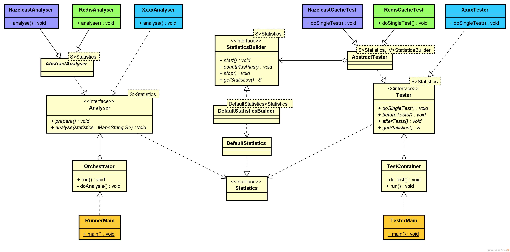

# Cluster-Performeter
>**Cluster-Performeter** is the tool for **fast prototyping and evaluating 
performance and scalability** of your distributed algorithm

## What it is designed for
* When you need to choose distributed in-memory storage or something like that
* When you need to choose deployment topology of you distributed in-memory storage and evaluate 
performance and scalability
* When you need to find the best suited way to use distributed in-memory storage for your business tasks

Then you need to build several prototypes. **Cluster-Performeter** is the tool that will help you.

## Design and architecture

>TODO

## How to use it
* You can run existing prototypes
* Or you can create you own prototypes _(see: **How to extend it**)_

To run existing prototypes you can use IDE or build project and use generated start scripts.

To build you need gradle.
For instance you can do `gradle installDist` and in the folder like 
`<moduleName>\build\install\<moduleName>\` 
you will find distributive.

To start instance of `Tester` use `org.vs.performeter.tester.TesterMain` in corresponding module, 
or `bin\cluster-performeter-redis.bat` shell script or `bin\cluster-performeter-hazlecase.bat` ...
You can start several instances of `Tester`

To start Orchestrator(Analyser) use `org.vs.performeter.analyser.RunnerMain` in corresponding module 
or `bin\analizer.bat` shell script 

## How to extend it

To do your own prototype you need to create your own module. You can find example how to do it in the 
`cluster-performeter-redis` and other modules.

You should encapsulate your test code inside a class that realize the interface 
`org.vs.performeter.tester.Tester` 

